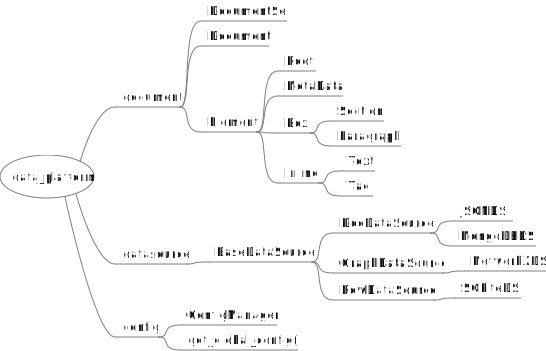
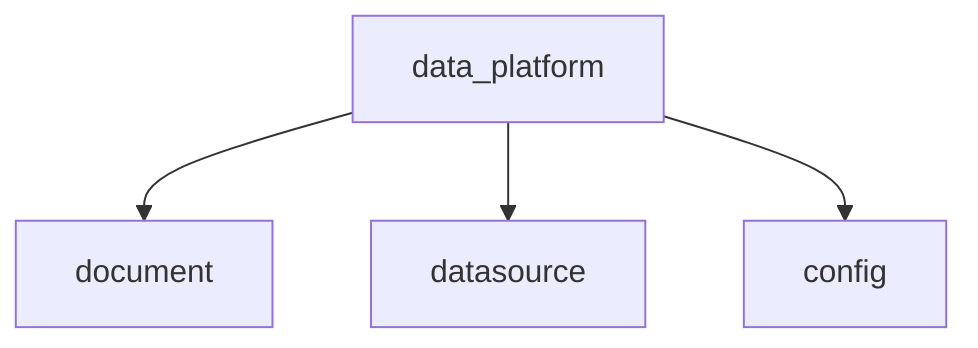
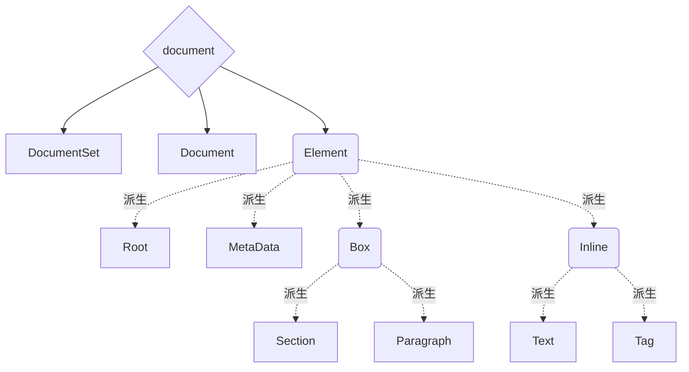
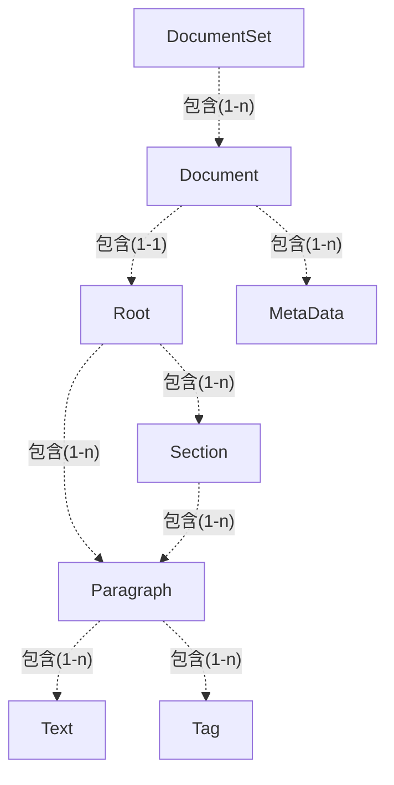
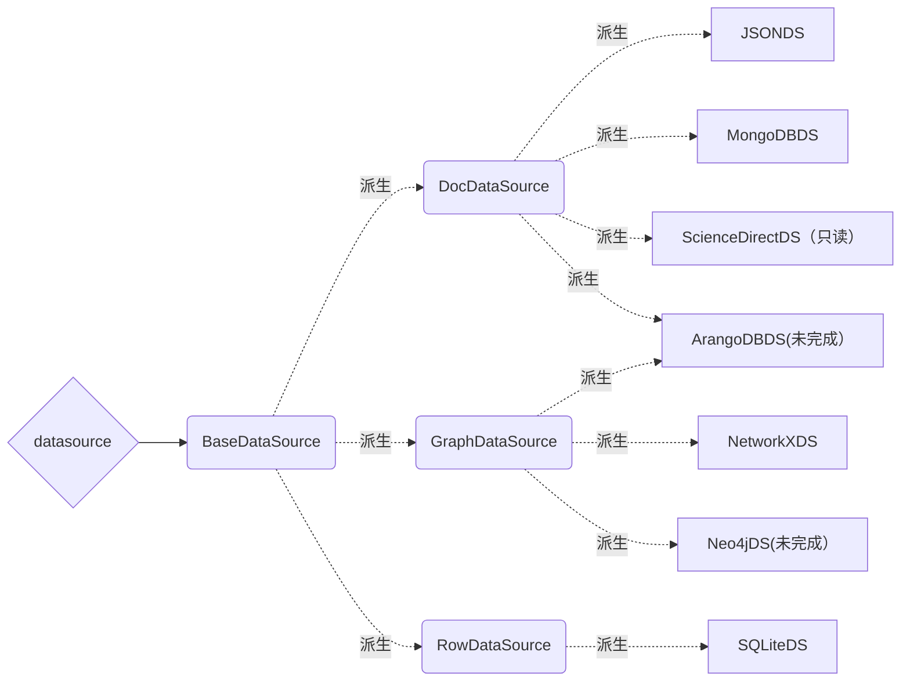
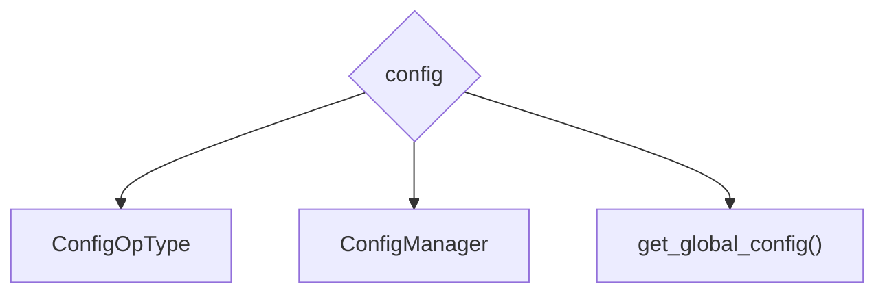

# D - 数据基础平台 (data_platform) 模块 tutorial

## 功能

1. 为所有功能模块提供基础数据结构支持
2. 为所有模块提供数据库连接的封装
3. 为了解耦而将其它模块共用的杂项代码提升到本模块

## data_platform 总结构图

### 另一个格式的示意图

### 总纲

本文档不会对于实现和调用说太细，而主要注重于整体架构和设计思路，便于后续接手的人有个入手方向。

具体实现问题请参阅代码和注释。本模块所有的函数都尽可能使用了 Python 3.5 开始引入的 Type Annotation 系统，通过看类型标注能解决很多在文档上很难说清楚的问题。

> 在架构图中，菱形为 module，矩形为 class，圆角矩形为 abstract base class（主要目的是定义接口）。
>
> 实线箭头是位置上的包含关系，虚线箭头有派生关系（继承）和内含关系（成员）两种，有标签标注。
>
> 内涵关系后的 1-1 和 1-n 说的是两者是一对一还是一对多关系。
>
> 一对多关系通常意味着前者包含的是后者的列表或者字典（之类的容器，具体是什么看代码里的类型标注）

**重要**：重视单元测试和代码评审！所有的更改必须都要通过单元测试！并且要一直修改优化测试，这样才能保证代码质量！

---

## 文档和文档集对象（document）

### document 功能概述

统一化的结构化文档和文档集表示（树形），并且提供了方便的元素检索和树展平（恢复纯文本）方法。

### document 实现架构图

### document 实例关系图

### document 设计思路

DocumentSet 继承于 `collections.UserDict`，本质上是个字典。之所以要额外套一层是需要在添加往文档集中添加文档时根据key来设置对应文档的id，从而连锁生成该文档下所有元素的id。（用于引用位置反查)

Document 和 Element 的设计借鉴于 HTML/XML DOM 模型，Element、Box、Inline 分别对应 HTML 当中的任意元素、盒状元素和行内元素。这样子可以保证把任意的结构化文档装进一个统一的对象里面。另一个功能是确保能产生可复用的唯一文档内的对象标识。

### document 开发指南

想不出来还能怎么做扩展开发，基本上思路还是从圆角矩形的接口那里继承，然后把所有的 abstract method 都实现，然后再做自己要弄的功能。

如果要构建 Document 的话（例如 DocDataSource 的 DocFactory），基本上也就是按照实例关系图自底向上逐个构建，可以参考 ScienceDirectDS 里的 DocFactory 写法。

## 数据源接口封装（datasource)

### datasource 功能概述

对三大类可能使用的数据源（文档、图、键值）的接口抽象，使得大部分的常见操作可以在只需要替换初始化方法的情况下就可以更换一个后台实现。

### datasource 实现架构图

### datasource 设计思路

基本思路是三种数据源中要操作的实体每种都写一个CRUD函数，同时提供一个对应于特定数据源的平台相关接口（`query`）用来支持扩展功能。

具体各个数据源的 CRUD 分别是什么参考下表：

数据源|Create|Read|Update|Delete
---|---|---|---|---
DocDataSource|create_doc|read_doc|update_doc|delete_doc
GraphDataSource|create_graph create_node create_edge|read_graph read_node read_edge|update_graph update_node update_edge|delete_graph delete_node delete_edge
RowDataSource|create_row|read_row|update_row|delete_row

### datasource 开发指南

如果需要开发新数据源的，请继承对应的圆角矩形，然后实现所有的虚方法，再在 test\test_data_platform 里面对应的测试集中通过继承对应的 TestXXXDataSource 实现一个 TestCase 类，然后在 runtest.py 中引入刚刚实现的 TestCase，并加入到 `TEST_CASES` 中去。运行 `python runtest.py` 确保所有单元测试都能通过。

## 配置管理（config)

### config 功能概述

ConfigManager 本质上是字典。额外提供类似于 schema 的格式检查和路径提取功能。

ConfigOpType 是枚举类型，是配合 schema 检查使用的操作符。

get_global_config() 会读取一个全局的配置文件，用于运行初始化。

### config 实现架构图

### config 设计思路

主要是为了解决 document 和 datasource 构建中出现的复杂配置字典的类型/内容验证问题，例如当需要从层层嵌套的字典中取一个长路径的时候，每一层都要做是否存在的验证，还要解决诸如默认值或者 fallback 处理之类的问题，于是做了这样一个配置管理器。

Schema 的格式基本上是拍脑袋想出来的，部分借鉴了 MongoDB 用的查询语言，以及类似于 dictify 和 JSON Schema 的语法。（其实理想情况下是用 JSON Schema 这种标准，但是奈何直到开发完成不知道多久了，写这个教程的时候那玩意儿现在还是 draft-7，这让人怎么敢用？）

get_global_config() 会试图从三个层级加载 `GLOBAL_CONFIG_FILENAME` 也就是 .knownet.json 作为全局配置文件：

1. 系统级 site-wise：Linux 下是 `/etc`，Windows 下是 `%PROGRAMDATA%`
2. 用户级 user：Linux 下是 `~`，Windows 下是 `%APPDATA%`
3. 本地配置 local：会从当前工作目录（`pathlib.Path.cwd()`）开始逐级向上查找，最多10层，找到为止

其优先级是层层递进的，后者的对应项会覆盖前者。也就是说，本地配置的优先级最高，请注意。

### config 开发指南

如果只是要路径检查就只用管 `check_node`（只检查是否存在） 和 `check_get` （检查的同时还返回所需的值）就好，目前代码当中大量使用。

如果想要做 schema 的全面检查，请参考 data_platform\.reference\schema_example.py
